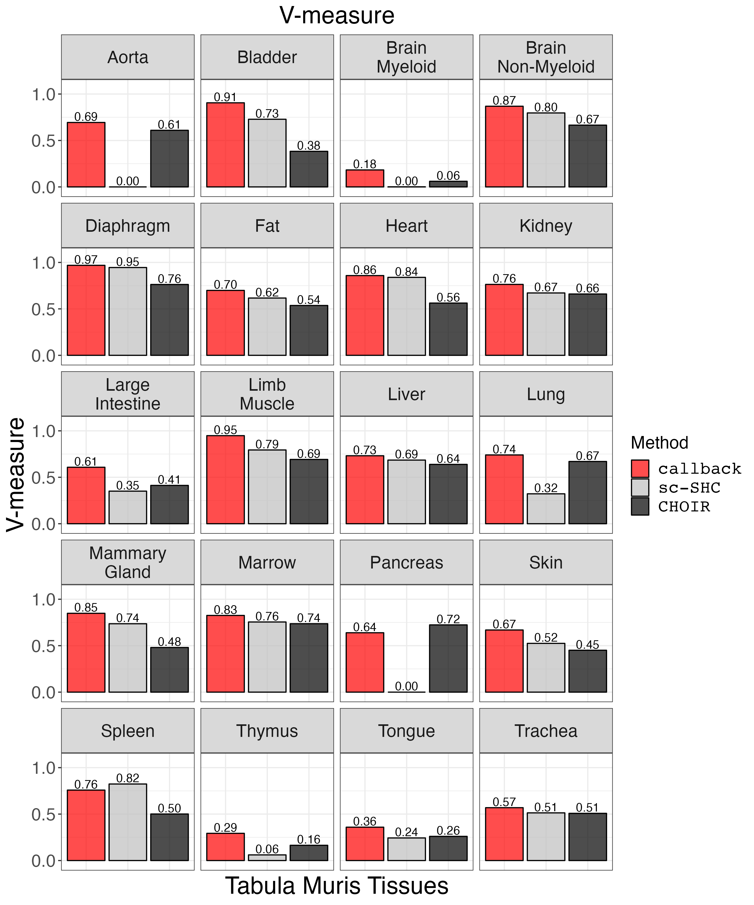
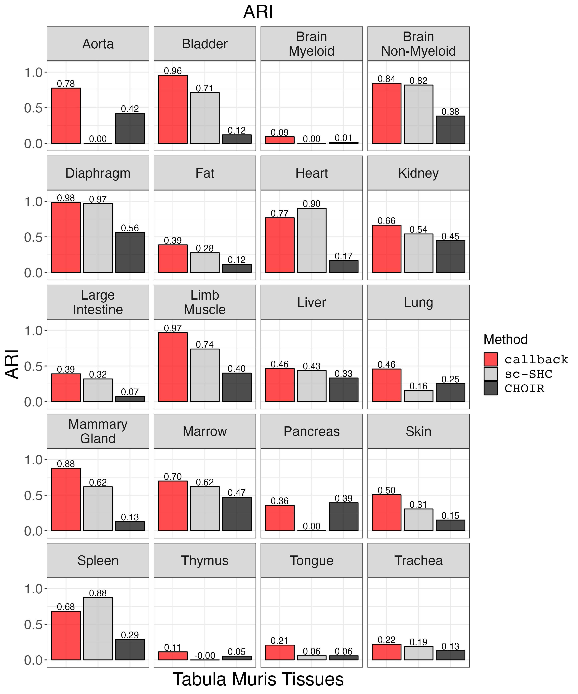
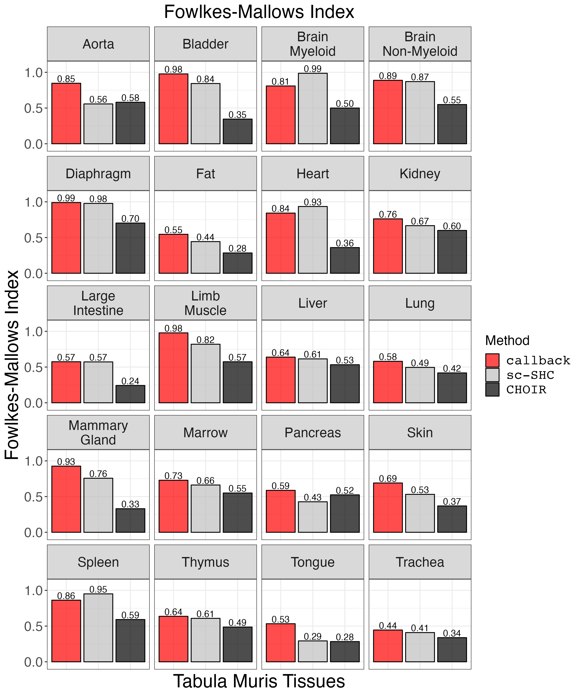
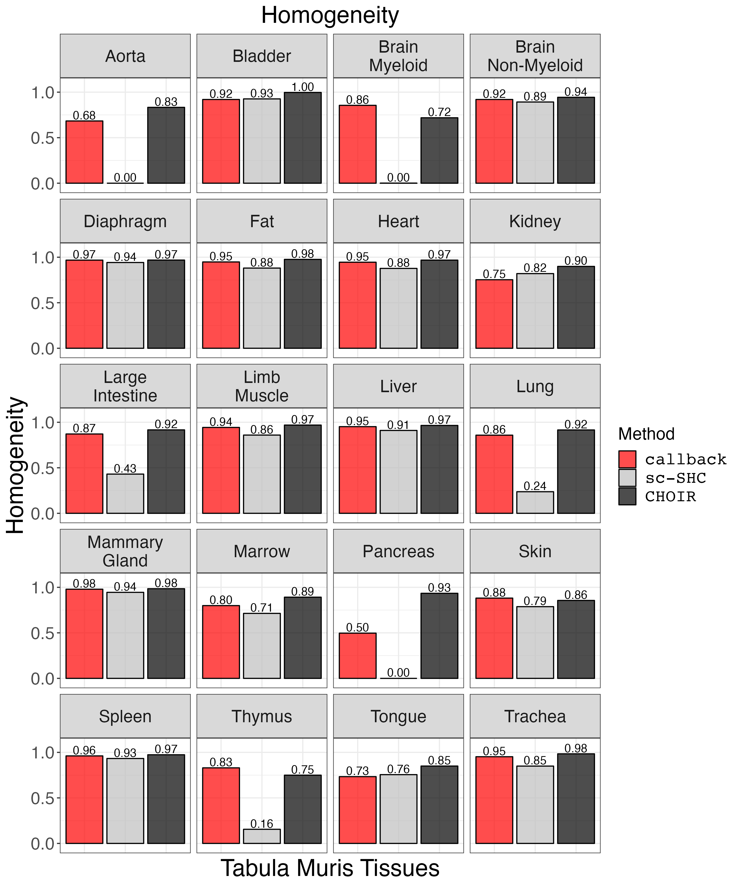
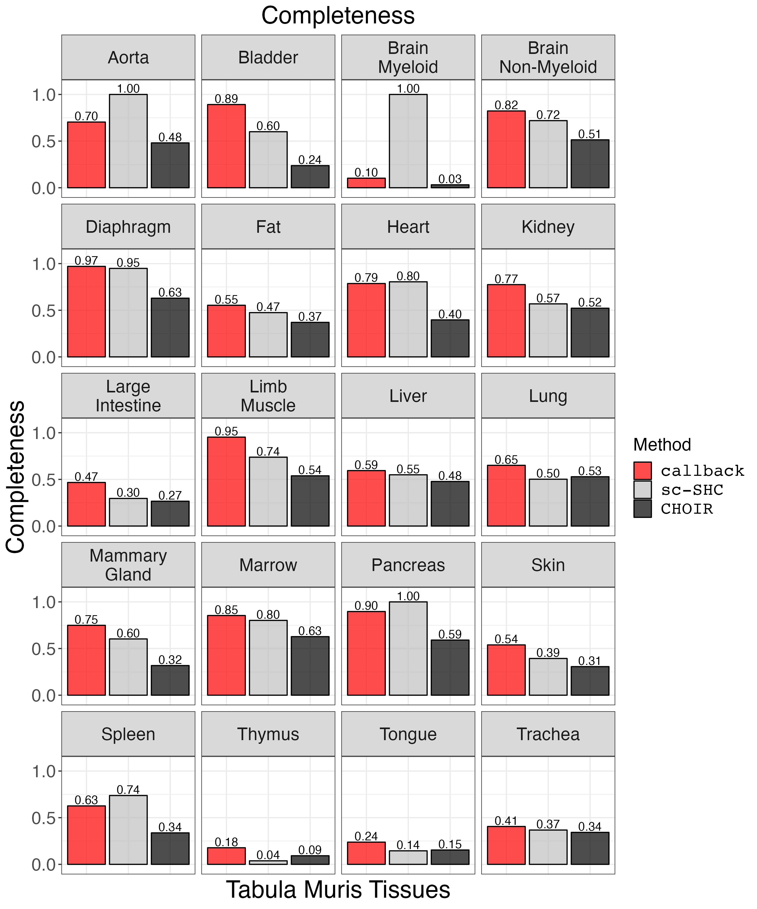
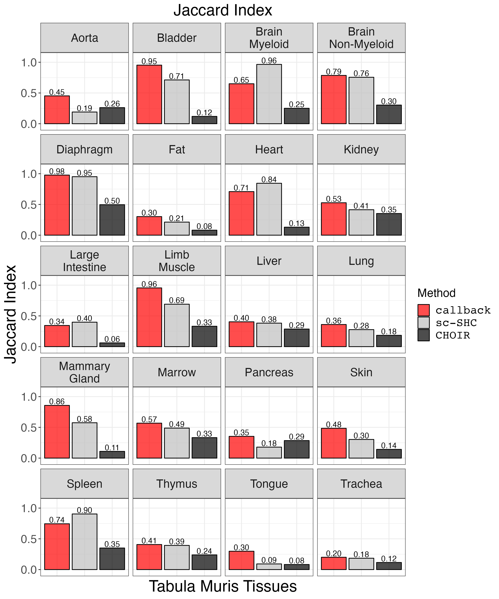
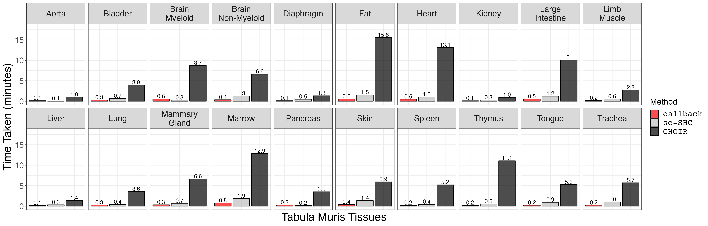

```{r, include = FALSE}
knitr::opts_chunk$set(
  collapse = TRUE,
  comment = "#>"
)

knitr::opts_chunk$set(eval = FALSE)


```

```{r setup}
suppressPackageStartupMessages({
library(callbackreproducibility)

library(plyr)

library(Seurat)

library(ggplot2)
library(patchwork)
library(grid)
})
```


First, we load the metrics data from clustering the Tabula Muris data with
`callback`, `sc-SHC`, and `CHOIR`.

```{r load_metrics_data}

cluster_metrics_df <- read.csv("cluster_metrics_df.csv")


# clean up tissue names
cluster_metrics_df$tissue_name <- gsub("-counts.csv", "", cluster_metrics_df$tissue_name)
cluster_metrics_df$tissue_name <- factor(cluster_metrics_df$tissue_name)
cluster_metrics_df$tissue_name <- plyr::revalue(cluster_metrics_df$tissue_name, c("Brain_Myeloid"      = "Brain\nMyeloid",
                                                    "Brain_Non-Myeloid"  = "Brain\nNon-Myeloid",
                                                    "Large_Intestine"    = "Large\nIntestine",
                                                    "Limb_Muscle"        = "Limb\nMuscle",
                                                    "Mammary_Gland"      = "Mammary\nGland"))

```


Plot V-measure.
```{r v_measure_plot}
vmeasure_plot <- clustering_metrics_facet_plot(cluster_metrics_df, "v_measure_results", "V-measure") 
ggsave("vmeasure_plot.png", vmeasure_plot, width = 2 * 1440, height = 2.4 * 1440, units = 'px')
```

{width=100%}


Plot ARI.
```{r ari_plot}
ari_plot <- clustering_metrics_facet_plot(cluster_metrics_df, "ari", "ARI")
ggsave("ari_plot.png", ari_plot, width = 2 * 1440, height = 2.4 * 1440, units = 'px')
```

{width=100%}


Plot FMI.
```{r fm_plot}
fm_plot <- clustering_metrics_facet_plot(cluster_metrics_df, "fowlkes_mallows_results", "Fowlkes-Mallows Index")
ggsave("fm_plot.png", fm_plot, width = 2 * 1440, height = 2.4 * 1440, units = 'px')
```

{width=100%}


Plot homogeneity.
```{r homogeneity_plot}
homogeneity_plot <- clustering_metrics_facet_plot(cluster_metrics_df, "homogeneity_results", "Homogeneity") 
ggsave("homogeneity_plot.png", homogeneity_plot, width = 2 * 1440, height = 2.4 * 1440, units = 'px')
```

{width=100%}

Plot completeness.
```{r completeness_plot}
completeness_plot <- clustering_metrics_facet_plot(cluster_metrics_df, "completeness_results", "Completeness") 
ggsave("completeness_plot.png", completeness_plot, width = 2 * 1440, height = 2.4 * 1440, units = 'px')
```

{width=100%}

Plot Jaccard Similarity Index.
```{r jaccard_plot}
jaccard_plot <- clustering_metrics_facet_plot(cluster_metrics_df, "jaccard_results", "Jaccard Index")
ggsave("jaccard_plot.png", jaccard_plot, width = 2 * 1440, height = 2.4 * 1440, units = 'px')

```

{width=100%}


Next, we compare the timing results for the Tabula Muris tissues. First, we
load the data and do some minor data cleaning.
```{r tissue_timing}
tissue_timing_df <- read.csv("tissue_timing_df.csv", row.names = 1)

# order factor levels
tissue_timing_df$method<- factor(tissue_timing_df$method, levels=c("callback", "sc-SHC", "CHOIR"))

# remove underscores from tissue names
tissue_timing_df$tissue <- gsub("_", "\n", tissue_timing_df$tissue)
```

We plot the timing data.
```{r tissue_timing_plot}
small_text_size <- 16
large_text_size <- 22

p <- ggplot2::ggplot(tissue_timing_df, ggplot2::aes(x=method, y=time, fill=method, label=sprintf("%0.1f", round(time, digits = 1)))) +
  ggplot2::geom_bar(stat = "identity", alpha = 0.7, colour = 'black') + 
  ggplot2::facet_wrap(~tissue, nrow = 2) +
  ggplot2::xlab("Tabula Muris Tissues") + 
  ggplot2::ylab("Time Taken (minutes)") +
  ggplot2::labs(fill = "Method") + 
  ggplot2::ylim(c(0,18)) +
  ggplot2::scale_fill_manual(values = c("red", "grey", "black"), labels = c("callback", "sc-SHC", "CHOIR")) + 
  ggplot2::theme_bw() +
  ggplot2::theme(axis.ticks.x = ggplot2::element_blank(), 
                 axis.text.x = ggplot2::element_blank(),
                 axis.text = ggplot2::element_text(size = small_text_size),
                 axis.title = ggplot2::element_text(size = large_text_size),
                 strip.text = ggplot2::element_text(size = small_text_size), 
                 legend.text = ggplot2::element_text(size = small_text_size, family = "Courier"),
                 legend.title = ggplot2::element_text(size = small_text_size)) + 
  geom_text(vjust = -0.2)

ggsave("choir_timing.png", p, width = 4 * 1440, height = 4 * 460, units = "px")
```

{width=100%}


Finally, we plot UMAPs for selected tissues.
```{r load_limb_muscle}
diaphragm <- readRDS(file = "Diaphragmcluster_results_seurat.rds")
limb_muscle <- readRDS(file = "Limb_Musclecluster_results_seurat.rds")
```

```{r clean_data}
# remove NAs
limb_muscle <- subset(limb_muscle, subset = cell_ontology_class %in% levels(factor(limb_muscle@meta.data$cell_ontology_class)))
diaphragm <- subset(diaphragm, subset = cell_ontology_class %in% levels(factor(diaphragm@meta.data$cell_ontology_class)))

# clean up cell type labels for limb_muscle
#limb_muscle@meta.data$cell_ontology_class[limb_muscle@meta.data$cell_ontology_class == ""] <- "cardiac neuron"
#limb_muscle@meta.data$cell_ontology_class <- trimws(limb_muscle@meta.data$cell_ontology_class, whitespace = " cell")

# shorten cell type labels for diaphragm
#diaphragm@meta.data$cell_ontology_class <- trimws(diaphragm@meta.data$cell_ontology_class, whitespace = " cell")

# sort levels by size of group (limb_muscle)
limb_muscle@meta.data$cell_ontology_class <- as.factor(limb_muscle@meta.data$cell_ontology_class)
sorted_limb_muscle_clusters <- names(sort(summary(as.factor(na.omit(limb_muscle@meta.data$cell_ontology_class))), decreasing = TRUE))
limb_muscle@meta.data$cell_ontology_class <- factor(limb_muscle@meta.data$cell_ontology_class, levels = sorted_limb_muscle_clusters)

# sort levels by size of group (diaphragm)
diaphragm@meta.data$cell_ontology_class <- as.factor(diaphragm@meta.data$cell_ontology_class)
sorted_diaphragm_clusters <- names(sort(summary(as.factor(na.omit(diaphragm@meta.data$cell_ontology_class))), decreasing = TRUE))
diaphragm@meta.data$cell_ontology_class <- factor(diaphragm@meta.data$cell_ontology_class, levels = sorted_diaphragm_clusters)
```


```{r plot_limb_muscle}
y_limits <- c(-30, 12)
x_limits <- c(-20, 20)
legend_location <- c(0.1, 0.2)


tissue <- limb_muscle
limb_muscle_curated_scatter <- custom_scatter(tissue, reduction = "umap", group_by = "cell_ontology_class", x_title = "UMAP 1", y_title = "UMAP 2", pt.size = 4) +
  theme(legend.position = legend_location) + guides(color=guide_legend(ncol=2)) + 
  xlim(x_limits) + ylim(y_limits) + 
  scale_colour_discrete(labels = function(x) stringr::str_wrap(x, width = 15))

limb_muscle_default_scatter <- custom_scatter(tissue, reduction = "umap", group_by = "seurat_clusters", x_title = "UMAP 1", y_title = "UMAP 2", pt.size = 4) +
  NoLegend() + xlim(x_limits) + ylim(y_limits)
limb_muscle_callback_scatter <- custom_scatter(tissue, reduction = "umap", group_by = "callback_idents", x_title = "UMAP 1", y_title = "UMAP 2", pt.size = 4) + 
  NoLegend() + xlim(x_limits) + ylim(y_limits)
limb_muscle_scSHC_scatter <- custom_scatter(tissue, reduction = "umap", group_by = "scSHC_clusters", x_title = "UMAP 1", y_title = "UMAP 2", pt.size = 4) +
  NoLegend() + xlim(x_limits) + ylim(y_limits)
limb_muscle_CHOIR_scatter <- custom_scatter(tissue, reduction = "umap", group_by = "CHOIR_clusters_0.05", x_title = "UMAP 1", y_title = "UMAP 2", pt.size = 4) + 
  NoLegend() + xlim(x_limits) + ylim(y_limits)
```

```{r plot_diaphragm}
tissue <- diaphragm
diaphragm_curated_scatter <- custom_scatter(tissue, reduction = "umap", group_by = "cell_ontology_class", x_title = "UMAP 1", y_title = "UMAP 2", pt.size = 4) + 
  theme(legend.position = legend_location) + 
  guides(color=guide_legend(ncol=2)) + 
  xlim(x_limits) + ylim(y_limits) +
  scale_colour_discrete(labels = function(x) stringr::str_wrap(x, width = 15))

diaphragm_default_scatter <- custom_scatter(tissue, reduction = "umap", group_by = "seurat_clusters", x_title = "UMAP 1", y_title = "UMAP 2", pt.size = 4) + 
  NoLegend() + xlim(x_limits) + ylim(y_limits)
diaphragm_callback_scatter <- custom_scatter(tissue, reduction = "umap", group_by = "callback_idents", x_title = "UMAP 1", y_title = "UMAP 2", pt.size = 4) + 
  NoLegend() + xlim(x_limits) + ylim(y_limits)
diaphragm_scSHC_scatter <- custom_scatter(tissue, reduction = "umap", group_by = "scSHC_clusters", x_title = "UMAP 1", y_title = "UMAP 2", pt.size = 4) + 
  NoLegend() + xlim(x_limits) + ylim(y_limits)
diaphragm_CHOIR_scatter <- custom_scatter(tissue, reduction = "umap", group_by = "CHOIR_clusters_0.05", x_title = "UMAP 1", y_title = "UMAP 2", pt.size = 4) +
  NoLegend() + xlim(x_limits) + ylim(y_limits)
```

```{r plot_grid}
row_label_1 <- wrap_elements(panel = textGrob('Diaphragm', gp = gpar(fontsize = 64), rot = 90))
row_label_2 <- wrap_elements(panel = textGrob('Limb Muscle', gp = gpar(fontsize = 64), rot = 90))

column_label_1 <- wrap_elements(panel = textGrob('Curated Labels', gp = gpar(fontsize = 64)))
column_label_2 <- wrap_elements(panel = textGrob('callback', gp = gpar(fontsize = 64, fontfamily = "Courier")))
column_label_3 <- wrap_elements(panel = textGrob('sc-SHC', gp = gpar(fontsize = 64, fontfamily = "Courier")))
column_label_4 <- wrap_elements(panel = textGrob('CHOIR', gp = gpar(fontsize = 64, fontfamily = "Courier")))

patchwork_grid <- plot_spacer() + column_label_1 + column_label_2 + column_label_3 + column_label_4 + 
  row_label_1 + diaphragm_curated_scatter + diaphragm_callback_scatter + diaphragm_scSHC_scatter + diaphragm_CHOIR_scatter +
  plot_spacer() + column_label_1 + column_label_2 + column_label_3 + column_label_4 +
  row_label_2 + limb_muscle_curated_scatter + limb_muscle_callback_scatter + limb_muscle_scSHC_scatter + limb_muscle_CHOIR_scatter + 
  plot_layout(widths = c(1, 5, 5, 5, 5),
              heights = c(1,3,1,3))
```


```{r save_grid}

ggsave("tmp_umap_grid.png", patchwork_grid, width = 1.5 * 2^13, height = 2^13, units = "px")
```


{width=100%}


