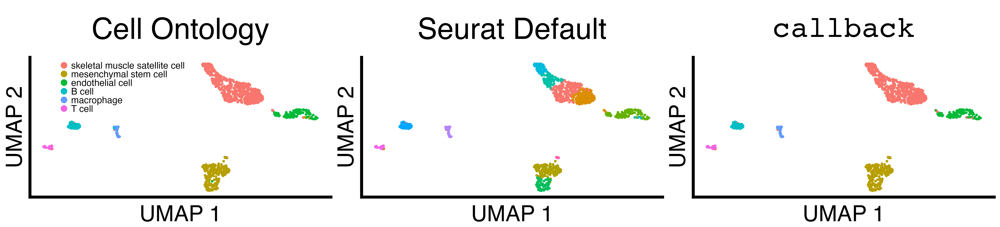
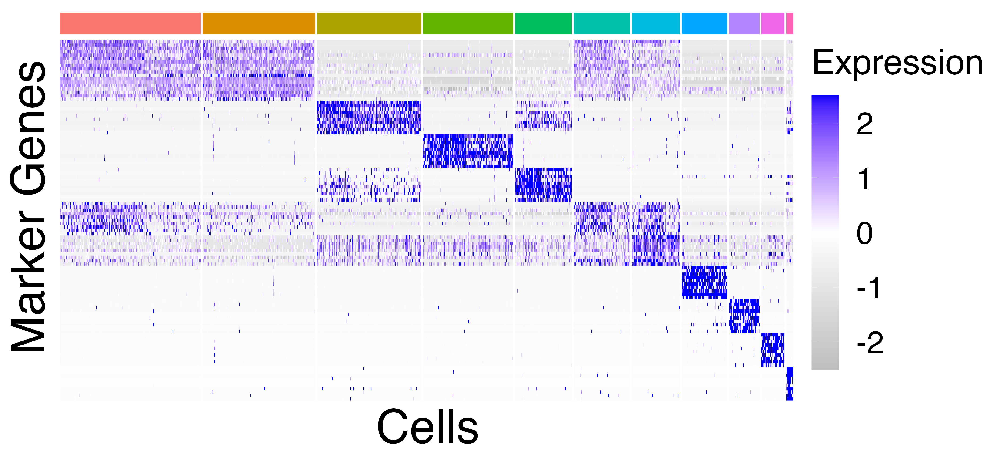
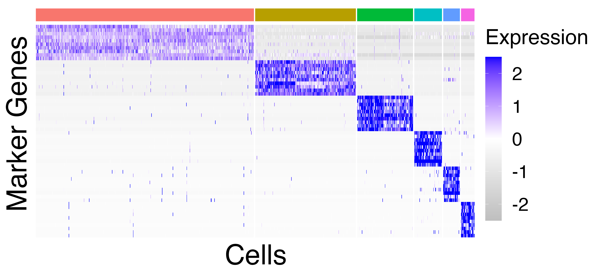
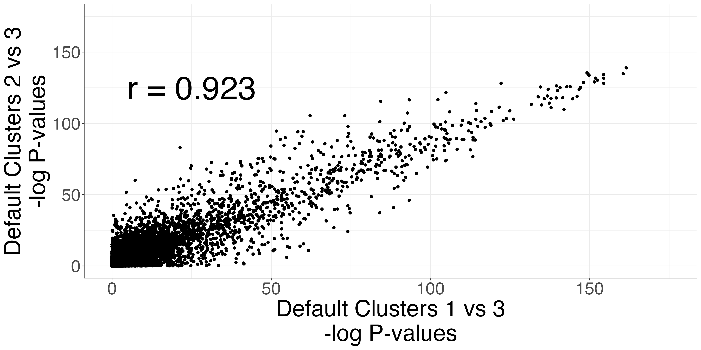
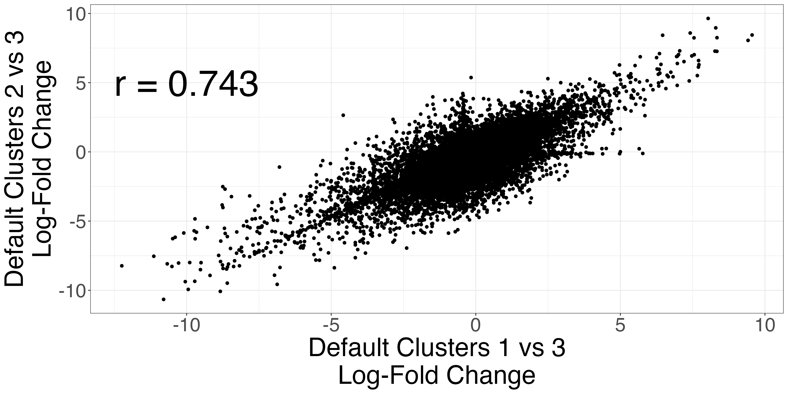
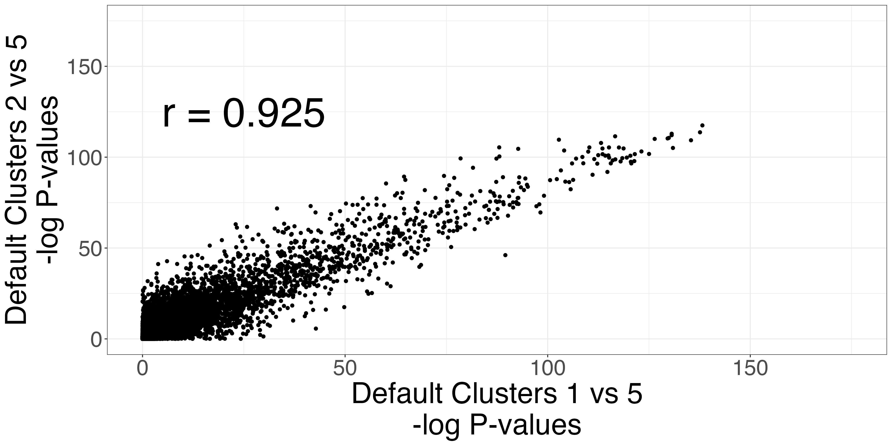
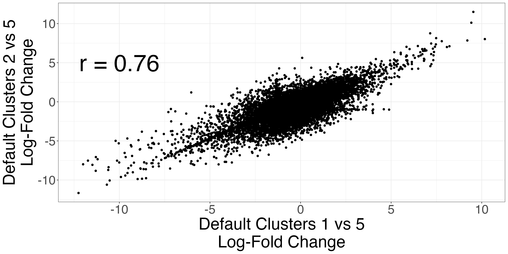
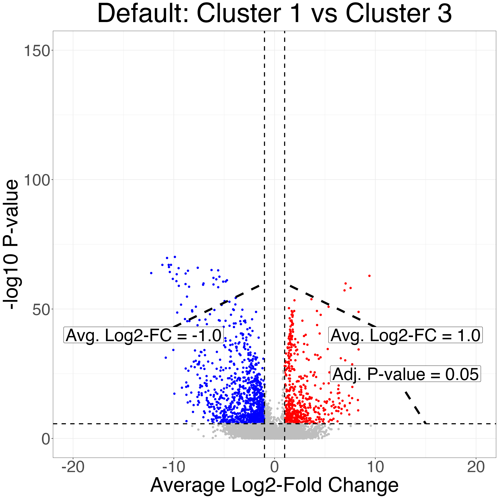
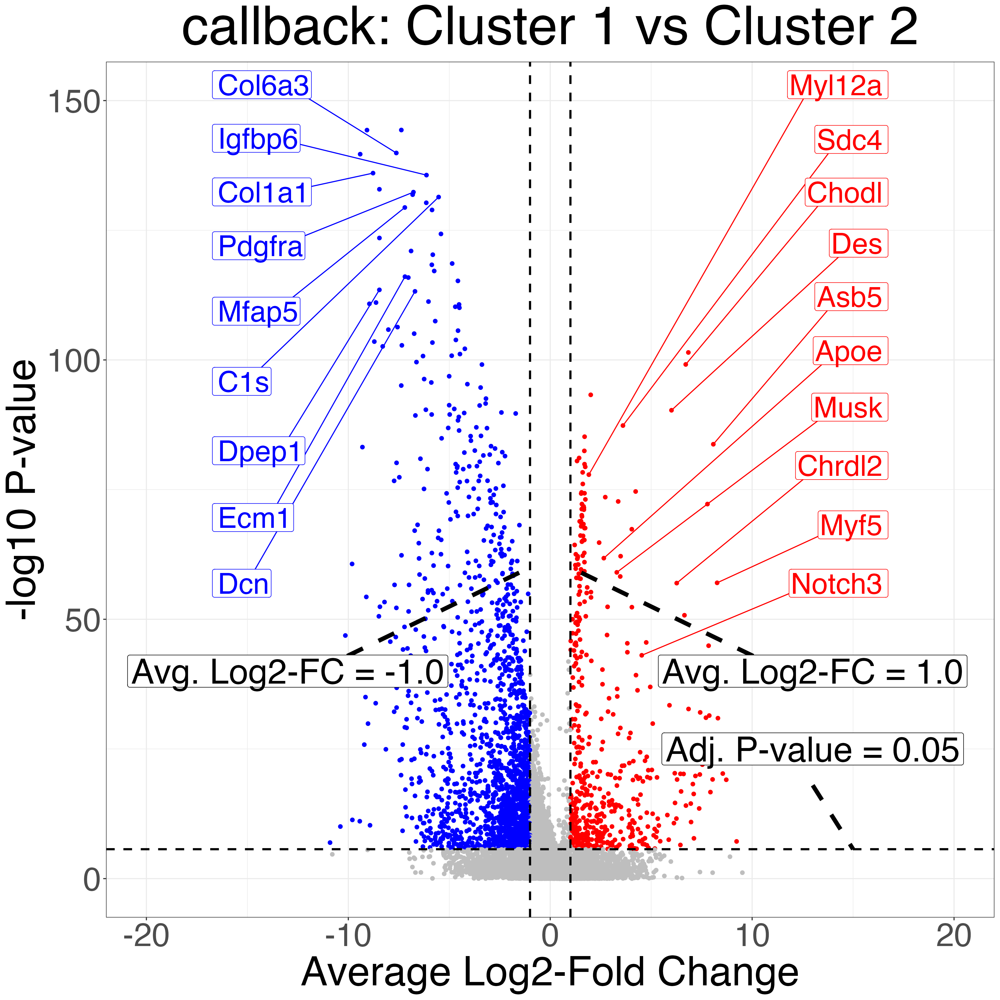

```{r, include = FALSE}
knitr::opts_chunk$set(
  collapse = TRUE,
  comment = "#>"
)

knitr::opts_chunk$set(eval = FALSE)
```

```{r setup}
suppressPackageStartupMessages({
library(callbackreproducibility)
library(ggplot2)
library(patchwork)
library(grid)
})

```


```{r marker_genes}

mesenchymal_stem_cells_marker_genes <- c(
  "Col6a3",
  "Col1a1",
  "Igfbp6",
  "Pdgfra",
  "C1s",
  "Mfap5",
  "Ecm1", 
  "Dcn",
  "Dpep1"
)

skeletal_muscle_satellite_cell_marker_genes <- c(
  "Des",
  "Chodl",
  "Myl12a",
  "Asb5",
  "Sdc4",
  "Apoe",
  "Musk",
  "Myf5",
  "Chrdl2",
  "Notch3"
)
```


First, we load the limb muscle seurat object and scale it for plotting the heatmap.
```{r load_data}
limb_muscle <- readRDS("Limb_Musclecluster_results_seurat.rds")
limb_muscle <- Seurat::ScaleData(limb_muscle, features = rownames(limb_muscle))
```


Next, we sort the cell ontology classes factors so that the cell type with the largest number of cells is first and the cell type with the fewest smallest is last.
```{r clean_up_data}
# sort levels by size of group (limb_muscle)
limb_muscle@meta.data$cell_ontology_class <- as.factor(limb_muscle@meta.data$cell_ontology_class)
sorted_limb_muscle_clusters <- names(sort(summary(as.factor(na.omit(limb_muscle@meta.data$cell_ontology_class))), decreasing = TRUE))
limb_muscle@meta.data$cell_ontology_class <- factor(limb_muscle@meta.data$cell_ontology_class, levels = sorted_limb_muscle_clusters)
```


We plot and save UMAP scatterplots of the Cell Ontology Class, the Seurat default clusters, and the `callback` clusters.
```{r save_scatterplots}
fig_3_umap_grid <- fig3_scatter_plots(limb_muscle, "limb_muscle", legend_pos = c(0.1, 0.8))

ggplot2::ggsave("fig_3_umap_grid.png", fig_3_umap_grid, width = 4.4 * 2^11, height = 1 * 2^11, units = "px")
```

{width=100%}


We plot and save heatmaps of the marker genes for the Seurat default clusters and the `callback` clusters.
```{r save_heatmaps}
heatmaps = fig3_heatmaps(limb_muscle, "limb_muscle")

ggplot2::ggsave("limb_muscle_callback_heatmap.png", heatmaps$callback_heatmap, width = 1.4 * 1.5 * 2^11, height = 1.3 * 1.5 * 2^10, units = "px")
ggplot2::ggsave("limb_muscle_default_heatmap.png", heatmaps$default_heatmap, width = 1.4 * 1.5 * 2^11, height = 1.3 * 1.5* 2^10, units = "px")

```

Seurat Default Clusters              |  callback Clusters 
:-------------------------:|:-------------------------:
{width=100%}  |  {width=100%}


The Seurat clusters appear over-clustered. We compare the test statistics produced from differential expression testing between two of the skeletal mucle satellite cell clusters and two of the mesenchymal stem cell clusters. The P-values and log-fold changes values for each comparison have high similarity.
```{r save_statistics_scatterplots}
scatters3 <- fig3_p_value_scatterplot(limb_muscle,
                         default_cluster1a = 1,
                         default_cluster1b = 2,
                         default_cluster2 = 3)

ggplot2::ggsave("fig3_pval3_scatterplot.png", scatters3$p_value_scatterplot, width = 2 * 2^11, height = 2^11, units = "px")
ggplot2::ggsave("fig3_logfc3_scatterplot.png", scatters3$lfc_scatterplot, width = 2 *2^11,  height = 2^11, units = "px")

scatters4 <- fig3_p_value_scatterplot(limb_muscle,
                         default_cluster1a = 1,
                         default_cluster1b = 2,
                         default_cluster2 = 5)

ggplot2::ggsave("fig3_pval4_scatterplot.png", scatters4$p_value_scatterplot, width = 2 * 2^11, height = 2^11, units = "px")
ggplot2::ggsave("fig3_logfc4_scatterplot.png", scatters4$lfc_scatterplot, width = 2 * 2^11,  height =  2^11, units = "px")
```

P-value comparison         | LFC comparison 
:-------------------------:|:-------------------------:
{width=100%}  |  {width=100%}

P-value comparison         | LFC comparison 
:-------------------------:|:-------------------------:
{width=100%}  |  {width=100%}


Finally, we do differential expression testing between the `callback` cluster corresponding to skeletal mucle satellite cells and the `callback` cluster corresponding to  mesenchymal stem cell cluster as well as two of the Seurat clusters that correspond to the same cell types. Notice that the P-values produced after clustering with `callback` are more significant due to the increased sample size from correctly clustering the two cell types.
```{r save_volcano_plots}
volcanos = fig3_volcano_plots(limb_muscle, "limb_muscle", callback_cluster1 = 1,
                                   callback_cluster2 = 2,
                                   default_cluster1 = 1,
                                   default_cluster2 = 3,
                                   ymax=150,
                                   y_increment = 100,
                                   genes_to_label_left = mesenchymal_stem_cells_marker_genes,
                                   genes_to_label_right = skeletal_muscle_satellite_cell_marker_genes)

ggplot2::ggsave("limb_muscle_volcano_plot_default.png", volcanos$volcano_default, width = 2^12, height = 2^12, units = "px")
ggplot2::ggsave("limb_muscle_volcano_plot_callback.png", volcanos$volcano_callback, width = 2^12,  height = 2^12, units = "px")
```


Seurat Default Clusters              | callback Clusters 
:-------------------------:|:-------------------------:
{width=100%}  |  {width=100%}


