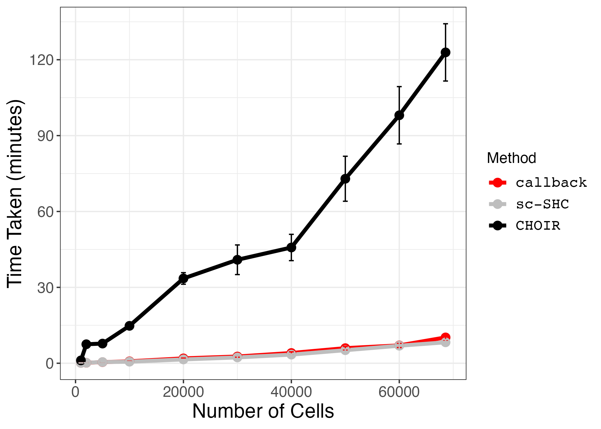
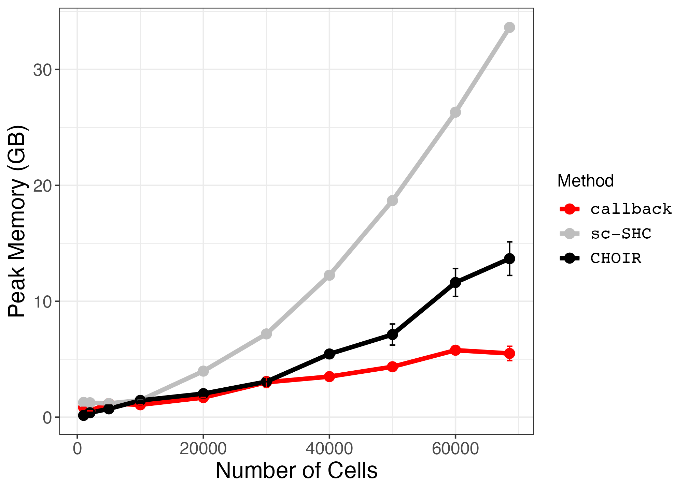

```{r, include = FALSE}
knitr::opts_chunk$set(
  collapse = TRUE,
  comment = "#>"
)


```

```{r setup}
suppressPackageStartupMessages({
library(callbackreproducibility)
library(ggplot2)
library(dplyr)
})
```


First, we load the results from five benchmarking runs on the subsets of the PBMC 68k dataset.

```{r load_timing_data}

pbmc_timing_memory_df1 <- read.csv("pbmc_timing_df1.csv", header = TRUE, row.names = 1)
pbmc_timing_memory_df2 <- read.csv("pbmc_timing_df2.csv", header = TRUE, row.names = 1)
pbmc_timing_memory_df3 <- read.csv("pbmc_timing_df3.csv", header = TRUE, row.names = 1)
pbmc_timing_memory_df4 <- read.csv("pbmc_timing_df4.csv", header = TRUE, row.names = 1)
pbmc_timing_memory_df5 <- read.csv("pbmc_timing_df5.csv", header = TRUE, row.names = 1)

pbmc_timing_memory_df <- rbind(pbmc_timing_memory_df1, pbmc_timing_memory_df2, pbmc_timing_memory_df3, pbmc_timing_memory_df4, pbmc_timing_memory_df5)

```


Next, we compute means and standard deviations across the five runs for each subset.
```{r summarize_data}
pbmc_timing_memory_df$method <- factor(pbmc_timing_memory_df$method, levels = c("callback", "sc-SHC", "CHOIR"))

pbmc_timing_memory_df$memory <- pbmc_timing_memory_df$memory * 0.00104858 # convert from mebibytes to gigabytes

timing_summary_df <- pbmc_timing_memory_df %>% group_by(method, num_cells) %>% summarize(
  mean = mean(time), 
  sd = sd(time))

memory_summary_df <- pbmc_timing_memory_df %>% group_by(method, num_cells) %>% summarize(
  mean = mean(memory), 
  sd = sd(memory))
```


We plot the means with error bars corresponding to the standard deviations.
```{r plot_data}
small_text_size <- 12
large_text_size <- 16

pbmc_time_plot <- ggplot2::ggplot(timing_summary_df, ggplot2::aes(x = num_cells, y = mean, color = method)) + 
  ggplot2::geom_line(size = 1.5) + 
  ggplot2::geom_point(size = 3) +
  geom_errorbar(aes(x=num_cells, ymin=mean-sd, ymax=mean+sd)) + 
  ggplot2::scale_color_manual(values = c("red", "grey", "black")) +
  scale_y_continuous(breaks=seq(0,150,30)) + 
  ggplot2::theme_bw() +
  ggplot2::xlab("Number of Cells") + 
  ggplot2::ylab("Time Taken (minutes)") +
  ggplot2::labs(color = "Method") + 
  ggplot2::theme(axis.text = ggplot2::element_text(size = small_text_size),
                 axis.title = ggplot2::element_text(size = large_text_size),
                 strip.text = ggplot2::element_text(size = small_text_size), 
                 legend.text = ggplot2::element_text(size = small_text_size, family = "Courier"),
                 legend.title = ggplot2::element_text(size = small_text_size))


pbmc_memory_plot <- ggplot2::ggplot(memory_summary_df, ggplot2::aes(x = num_cells, y = mean, color = method)) + 
  ggplot2::geom_line(size = 1.5) + 
  ggplot2::geom_point(size = 3) +
  geom_errorbar(aes(x=num_cells, ymin=mean-sd, ymax=mean+sd)) + 
  ggplot2::scale_color_manual(values = c("red", "grey", "black")) +
  #scale_y_continuous(breaks=seq(0,150,30)) + 
  ggplot2::theme_bw() +
  ggplot2::xlab("Number of Cells") + 
  ggplot2::ylab("Peak Memory (GB)") +
  ggplot2::labs(color = "Method") + 
  ggplot2::theme(axis.text = ggplot2::element_text(size = small_text_size),
                 axis.title = ggplot2::element_text(size = large_text_size),
                 strip.text = ggplot2::element_text(size = small_text_size), 
                 legend.text = ggplot2::element_text(size = small_text_size, family = "Courier"),
                 legend.title = ggplot2::element_text(size = small_text_size))
```


Finally, we save the plots.
```{r save_plots}
ggplot2::ggsave("pbmc_timing.png", pbmc_time_plot, width = 1.4 * 1440, height = 1440, units = "px")
ggplot2::ggsave("pbmc_memory.png", pbmc_memory_plot, width = 1.4 * 1440, height = 1440, units = "px")
```


{width=100%}
{width=100%}
